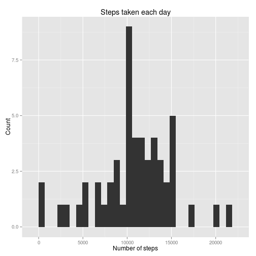
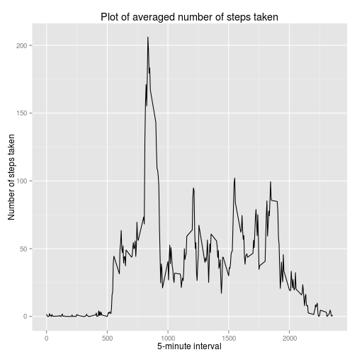
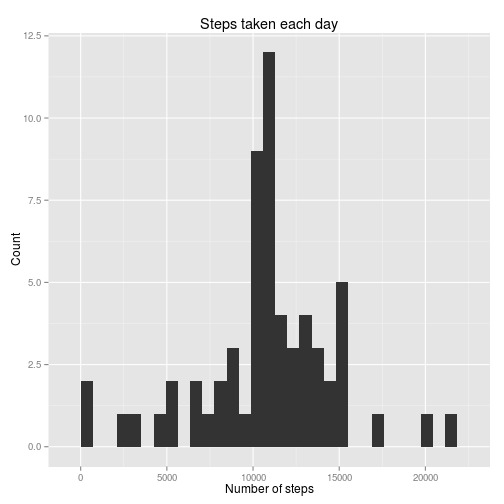
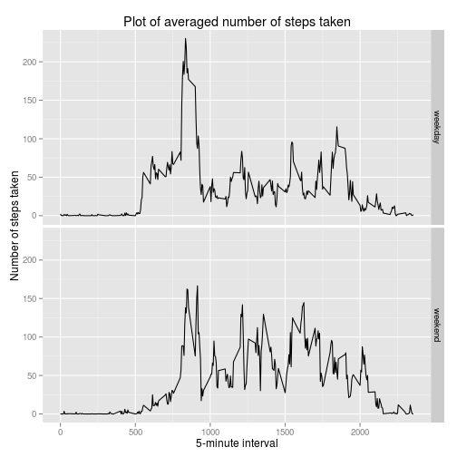

# Reproducible Research: Peer Assessment 1
tuanh118

## Loading and preprocessing the data
Load data into a data frame.

```r
activity <- read.csv("activity.csv")
```

Look at the data.

```r
str(activity)
```

```
## 'data.frame':	17568 obs. of  3 variables:
##  $ steps   : int  NA NA NA NA NA NA NA NA NA NA ...
##  $ date    : Factor w/ 61 levels "2012-10-01","2012-10-02",..: 1 1 1 1 1 1 1 1 1 1 ...
##  $ interval: int  0 5 10 15 20 25 30 35 40 45 ...
```

```r
summary(activity)
```

```
##      steps               date          interval   
##  Min.   :  0.0   2012-10-01:  288   Min.   :   0  
##  1st Qu.:  0.0   2012-10-02:  288   1st Qu.: 589  
##  Median :  0.0   2012-10-03:  288   Median :1178  
##  Mean   : 37.4   2012-10-04:  288   Mean   :1178  
##  3rd Qu.: 12.0   2012-10-05:  288   3rd Qu.:1766  
##  Max.   :806.0   2012-10-06:  288   Max.   :2355  
##  NA's   :2304    (Other)   :15840
```

## What is mean total number of steps taken per day?
1. Here is the histogram of the total number of steps taken each day.

```r
total.steps <- aggregate(activity$steps, by=list(Category = activity$date), FUN = sum) # Sum up steps taken by date
total.steps.clean <- na.omit(total.steps) # Remove all NAs

library(ggplot2)
```

```
## Use suppressPackageStartupMessages to eliminate package startup messages.
```

```r
ggplot(total.steps.clean, aes(x)) + geom_histogram() + labs(title = "Steps taken each day", x = "Number of steps", y = "Count")
```

```
## stat_bin: binwidth defaulted to range/30. Use 'binwidth = x' to adjust this.
```

 

2. **Mean** and **median** total number of steps taken per day.

```r
format(round(mean(total.steps.clean$x), 2), nsmall = 2)
```

```
## [1] "10766.19"
```

```r
format(round(median(total.steps.clean$x), 2), nsmall = 2)
```

```
## [1] "10765.00"
```

## What is the average daily activity pattern?
1. A time series plot (i.e. type = "l") of the 5-minute interval and the average number of steps taken, averaged across all days.

```r
activity.clean <- na.omit(activity) # Remove missing values
intervals <- aggregate(activity.clean$steps, by = list(Category = activity.clean$interval), FUN = mean)

ggplot(intervals, aes(Category, x)) + geom_line() + labs(title = "Plot of averaged number of steps taken", x = "5-minute interval", y = "Number of steps taken")
```

 

2. The 5-minute interval with maximum number of steps.

```r
intervals$Category[which.max(intervals$x)]
```

```
## [1] 835
```

## Imputing missing values
1. Total number of missing values.

```r
sum(is.na(activity$steps))
```

```
## [1] 2304
```

2, 3. Imputing missing values with the averaged number of steps taken during that 5-minute interval across all days.

```r
activity.imputed <- activity

for (i in 1:length(activity.imputed$steps)) {
  if (is.na(activity.imputed$steps[i])) {
    activity.imputed$steps[i] = intervals$x[intervals$Category == activity.imputed$interval[i]]
  }
}
```

4. A histogram of the total number of steps taken each day.

```r
total.steps.imputed <- aggregate(activity.imputed$steps, by=list(Category = activity.imputed$date), FUN = sum)

ggplot(total.steps.imputed, aes(x)) + geom_histogram() + labs(title = "Steps taken each day", x = "Number of steps", y = "Count")
```

```
## stat_bin: binwidth defaulted to range/30. Use 'binwidth = x' to adjust this.
```

 

**Mean** and **median** total number of steps taken per day.

```r
format(round(mean(total.steps.imputed$x), 2), nsmall = 2)
```

```
## [1] "10766.19"
```

```r
format(round(median(total.steps.imputed$x), 2), nsmall = 2)
```

```
## [1] "10766.19"
```

Notice that the **mean** does not change while the **median** changes to have the same value as the mean.

## Are there differences in activity patterns between weekdays and weekends?
1. A new factor variable (date.class) indicating "weekday" or "weekend".

```r
activity.imputed$date.class <- as.factor(weekdays(as.Date(activity.imputed$date)) %in% c("Saturday", "Sunday"))
levels(activity.imputed$date.class) = c("weekday", "weekend")
head(activity.imputed)
```

```
##     steps       date interval date.class
## 1 1.71698 2012-10-01        0    weekday
## 2 0.33962 2012-10-01        5    weekday
## 3 0.13208 2012-10-01       10    weekday
## 4 0.15094 2012-10-01       15    weekday
## 5 0.07547 2012-10-01       20    weekday
## 6 2.09434 2012-10-01       25    weekday
```

2. A panel plot containing a time series plot of the 5-minute interval and the average number of steps taken, averaged across all weekday days or weekend days.

```r
intervals.imputed <- aggregate(activity.imputed$steps, by = list(interval = activity.imputed$interval, date.class = activity.imputed$date.class), FUN = mean)

ggplot(intervals.imputed, aes(interval, x)) + geom_line() + facet_grid(date.class ~ .) + labs(title = "Plot of averaged number of steps taken", x = "5-minute interval", y = "Number of steps taken")
```

 
